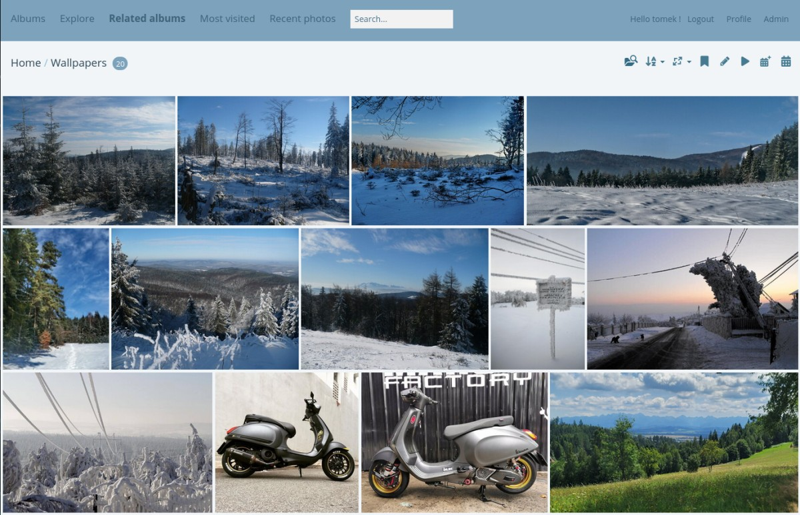
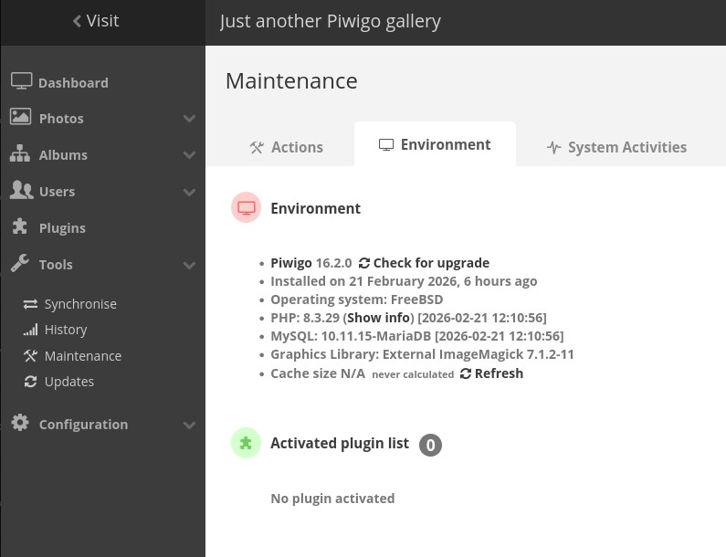

# iocage-plugin-piwigo auto-installation script v1.4

Piwigo 16.2.0 jail installer for **TrueNAS CORE 13 U7**  
Release target: **13.5-RELEASE**  
Script version: **v1.2**

This script installs:

- Piwigo 16.2.0
- MariaDB 10.11
- PHP 8.3
- Caddy Web Server
- ImageMagick + ffmpeg support
- Persistent ZFS database storage

---

## ✅ Tested On

- TrueNAS CORE 13 U7
- Jail: 13.5-RELEASE
- Piwigo 16.2.0


---

# Installation

### 1️⃣ Clone Repository

```
git clone https://github.com/YOUR_USERNAME/iocage-plugin-piwigo.git
cd iocage-plugin-piwigo
```

### 2️⃣ Edit Configuration

Edit:

```
includes/piwigo-config.txt
```

Set your:

- JAIL_NAME
- DB_PATH (must already exist as ZFS dataset)
- TIMEZONE
- POOL_PATH

⚠ The script **will NOT create the ZFS dataset automatically**.  
You must create it manually first:

Example:

```
zfs create WebData/piwigodb
```

Then verify it exists:

```
/mnt/WebData/piwigodb
```

---

### 3️⃣ Make Script Executable

```
chmod +x piwigo_install.sh
```

---

### 4️⃣ Run Installer

```
./piwigo_install.sh
```

After installation completes, credentials will be displayed and saved inside the jail:

```
/Piwigo-Info.txt
```

---

# Install Notes

- Initial setup from the WebUI requires you to change the database address to **127.0.0.1** instead of **localhost**, or it will fail.

Correct setting during first Piwigo setup:

```
Host: 127.0.0.1
```

---

# Variables

These are the variables that are available to change along with their defaults and a description of what they do.

Other variables should be left at default unless you have a good reason to change them.

---

### PHP_VERSION
- PHP version to use  
- Defaults to 8.3.29

### MARIADB_VERSION
- MariaDB version to use  
- Defaults to 10.11.15-MariaDB

---

# Mount Points (Recommended)

These should be mounted outside the jail if you want persistent storage:

- `/usr/local/www/piwigo/local/config` – config directory (database connection)
- `/usr/local/www/piwigo/galleries` – gallery storage
- `/usr/local/www/piwigo/upload` – uploads directory
- `/var/db/mysql` – database directory (ZFS dataset recommended)

---

# PHP Tuning (Already Applied by Script)

The installer applies:

```
memory_limit = 512M
upload_max_filesize = 100M
post_max_size = 100M
max_execution_time = 300
```

The required `mysqli` extension is installed automatically via:

```
php83-mysqli
```

No manual enabling is required.

---

# Caddy Tuning (Optional Advanced)

If running large galleries or heavy uploads, consider adjusting Caddy settings.

Example improved Caddyfile:

```
:80 {

    root * /usr/local/www/piwigo

    php_fastcgi 127.0.0.1:9000 {
        read_timeout 600s
        write_timeout 600s
    }

    encode gzip zstd

    file_server
}
```

You may also tune PHP-FPM pool settings:

```
pm = dynamic
pm.max_children = 35
pm.start_servers = 10
pm.min_spare_servers = 5
pm.max_spare_servers = 20
request_terminate_timeout = 300
```

These settings are optional and depend on your RAM and CPU.

-# MariaDB Tuning (Optional Advanced)

The installer applies safe and performance-oriented MariaDB settings
via a dedicated configuration file:

```
/usr/local/etc/mysql/conf.d/piwigo.cnf
```

Example configuration:

```
[mysqld]
bind-address=127.0.0.1
innodb_buffer_pool_size=256M
innodb_log_file_size=64M
max_connections=100
character-set-server=utf8mb4
collation-server=utf8mb4_unicode_ci
```

### Recommended Values Based on Jail RAM

For small / medium deployments (2–4GB RAM):

```
innodb_buffer_pool_size=256M
innodb_log_file_size=64M
```

For larger galleries (4GB+ RAM):

```
innodb_buffer_pool_size=512M
innodb_log_file_size=128M
```

For heavy usage (8GB+ RAM):

```
innodb_buffer_pool_size=1G
```

---

These settings are optional but recommended for production environments.  
Adjust values according to available RAM and workload.

---

# Upgrade Jail Release

To upgrade jail base version:

Outside the jail:

```
iocage upgrade -r 13.5-RELEASE Piwigo135
```

Inside the jail:

```
pkg update
pkg upgrade -y
```

---

# Screenshots

Gallery view:



Dashboard view:



---

# Notes

- This is NOT an official iXsystems plugin.
- This is a manual jail installer script.
- Designed for advanced TrueNAS users.
- Uses Caddy instead of nginx.

---

# Version

- TrueNAS Target: 13.5-RELEASE
- Script Version: v1.2
- Piwigo Version: 16.2.0

---

Enjoy your self-hosted gallery 🚀
